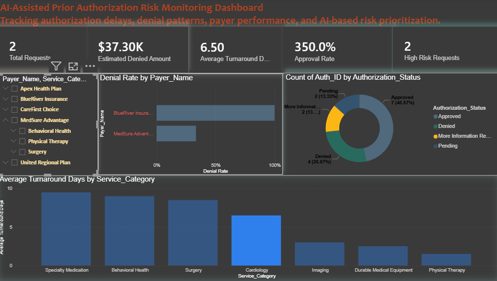

# AI-Assisted Prior Authorization Risk Monitoring System

AI-assisted healthcare operational analytics solution focused on prior authorization risk monitoring, denial analysis, turnaround visibility, and workflow prioritization using Power BI.

---

# Project Overview

This project was designed to simulate how healthcare organizations can combine Business Intelligence and AI-assisted prioritization concepts to improve operational visibility into authorization workflows.

The dashboard helps identify:

- High-risk authorization requests
- Denial trends and payer performance
- Turnaround delays
- Service categories with operational bottlenecks
- Workflow prioritization opportunities

Instead of creating only static reports, the goal was to design a lightweight operational intelligence solution that supports faster decision-making for healthcare operations teams.

---

# Key Features

- Executive KPI dashboard
- Approval and denial trend analysis
- AI-assisted risk scoring logic
- High-risk request prioritization
- Payer performance monitoring
- Turnaround time analytics
- Operational workflow visibility
- Interactive filtering and analysis

---

# Technologies Used

- Power BI
- DAX
- Power Query
- Data Modeling
- Healthcare Operational Analytics Concepts

---

# Dashboard KPIs

- Total Requests
- Approval Rate
- Denial Rate
- Average Turnaround Days
- High Risk Requests
- Estimated Denied Amount

---

# Business Goal

The objective of this project was to explore how AI-assisted analytics and Business Intelligence can support healthcare operations teams in identifying high-risk authorization requests earlier and prioritizing follow-up actions more effectively.

---

# Executive Overview Dashboard

---

# Workflow Overview

1. Healthcare authorization data imported into Power BI
2. Power Query used for transformation and preparation
3. DAX measures created for KPI calculations
4. AI-assisted risk scoring logic applied
5. Interactive dashboards built for operational monitoring
6. High-risk requests prioritized for workflow visibility

---

# Future Improvements

- Machine learning-based risk prediction
- Real-time healthcare API integration
- Advanced denial forecasting
- Operational alerting system
- Predictive workflow analytics

## Executive Overview Dashboard

